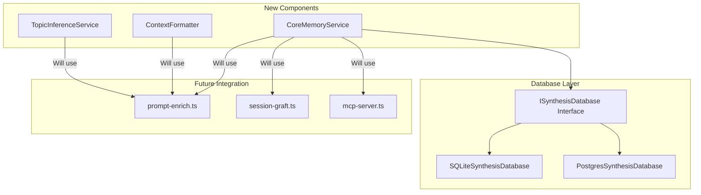

# Code Review: Epic 3 Batch 1 - Active Retrieval Foundation

**Date**: 2025-12-14
**Reviewer**: Code Review Agent
**Changes**: Issues 3.1, 3.3, 4.1

---

## Pass 0: Change Explanation

### What Changed

| File | Change Type | Description |
|------|-------------|-------------|
| `src/lib/topic-inference.ts` | Added (300 lines) | TopicInferenceService using Claude Haiku |
| `src/lib/context-formatter.ts` | Added (294 lines) | XML formatter for context injection |
| `src/lib/core-memory.ts` | Added (199 lines) | CoreMemoryService for always-inject blocks |
| `src/schema.ts` | Modified (+14 lines) | Added CoreMemoryBlock types |
| `src/db/interface.ts` | Modified (+28 lines) | Added Core Memory operations to interface |
| `src/db/sqlite-db.ts` | Modified (+87 lines) | SQLite Core Memory implementation |
| `src/db/postgres-db.ts` | Modified (+86 lines) | PostgreSQL Core Memory implementation |
| `docker/init/02-core-memory.sql` | Added (19 lines) | PostgreSQL init script |

### System Impact Diagram



### Consequences of Changes

**Direct Effects:**
- New service classes available for Active Retrieval pipeline
- Database interface extended with 4 new Core Memory methods
- Both SQLite and PostgreSQL backends support Core Memory storage

**Side Effects:**
- SQLite databases will auto-create `core_memory` table on next initialization
- PostgreSQL requires running new init script or `ensureCoreMemoryTable()` auto-creates

---

## Pass 1: Technical Issue Identification

### CRITICAL: PostgreSQL `ensureCoreMemoryTable()` Called On Every Operation

**File**: `src/db/postgres-db.ts`
**Lines**: 839-841, 851-852, 866, 883-884

```typescript
async getCoreMemoryBlock(blockType: CoreMemoryBlockType): Promise<CoreMemoryBlock | null> {
  // Ensure core_memory table exists
  await this.ensureCoreMemoryTable();  // <-- Called on EVERY get
```

Every Core Memory operation calls `ensureCoreMemoryTable()` which executes `CREATE TABLE IF NOT EXISTS`. While idempotent, this adds unnecessary latency (network round-trip + query parse/plan) to EVERY Core Memory operation.

**Impact**: If Core Memory is queried frequently (e.g., every prompt injection), this adds cumulative latency.

**Fix**: Move table creation to `init()` method or cache a "table exists" flag:

```typescript
private coreMemoryTableInitialized = false;

private async ensureCoreMemoryTable(): Promise<void> {
  if (this.coreMemoryTableInitialized) return;
  await this.sql`CREATE TABLE IF NOT EXISTS core_memory...`;
  this.coreMemoryTableInitialized = true;
}
```

**Priority**: High

---

### HIGH: Duplicate Type Definition for `CoreMemoryBlocks`

**Files**:
- `src/lib/context-formatter.ts:26-35`
- `src/lib/core-memory.ts:20-23`

```typescript
// context-formatter.ts
export interface CoreMemoryBlocks {
  persona?: {
    content: string;
    updatedAt: number;
  };
  human?: {
    content: string;
    updatedAt: number;
  };
}

// core-memory.ts
export interface CoreMemoryBlocks {
  persona?: CoreMemoryBlock;
  human?: CoreMemoryBlock;
}
```

These are **different types with the same name**:
- `context-formatter.ts` version has `updatedAt` (camelCase)
- `core-memory.ts` version uses full `CoreMemoryBlock` with `updated_at` (snake_case)

**Impact**: When integrating these services, TypeScript may allow assignment but runtime behavior differs. The `ContextFormatter` expects `updatedAt` but `CoreMemoryService` provides `updated_at`.

**Fix**: Use a single source of truth. Either:
1. Export `CoreMemoryBlocks` only from `core-memory.ts` and import in `context-formatter.ts`
2. Or rename one to avoid collision (e.g., `FormatterCoreMemoryBlocks`)

**Priority**: High (will cause runtime bugs when integrated)

---

### HIGH: Missing Export from `db/index.ts`

**File**: `src/db/index.ts` (not modified)

The `CoreMemoryBlockType` type is used in the interface but may not be exported from the main `db/index.ts` barrel.

**Verification needed**:
```bash
grep -n "CoreMemoryBlockType" src/db/index.ts
```

If not exported, consumers importing from `'./db/index.js'` won't have access to the type.

**Priority**: High (blocks integration)

---

### MEDIUM: Inconsistent Field Naming Convention

**Files**: `src/schema.ts`, `src/lib/core-memory.ts`, `src/lib/context-formatter.ts`

| Location | Field Name |
|----------|------------|
| `schema.ts` CoreMemoryBlock | `block_type`, `token_estimate`, `created_at`, `updated_at` |
| `context-formatter.ts` CoreMemoryBlocks | `updatedAt` |
| Database columns | `block_type`, `token_estimate`, etc. |

The codebase uses snake_case for database-mapped types (matching SQL) but `context-formatter.ts` introduced camelCase. This inconsistency will cause confusion.

**Priority**: Medium

---

### MEDIUM: TopicInferenceService API Key Validation

**File**: `src/lib/topic-inference.ts:43-50`

```typescript
constructor(
  apiKey: string,
  options: { ... } = {}
) {
  this.client = new Anthropic({ apiKey });
```

The constructor accepts an API key but doesn't validate it. If an empty string or invalid key is passed, the error only surfaces on first API call.

**Fix**: Add validation:
```typescript
if (!apiKey || apiKey.trim().length === 0) {
  throw new Error('TopicInferenceService requires a valid API key');
}
```

**Priority**: Medium

---

### MEDIUM: Memory Leak Potential in TopicInferenceService Cache

**File**: `src/lib/topic-inference.ts:113-116`

```typescript
// Cleanup expired entries periodically
if (this.cache.size > 100) {
  this.cleanupCache();
}
```

Cache cleanup only triggers when size exceeds 100 entries. If entries are added slowly (e.g., 1 per minute), the cache could grow unbounded before cleanup, containing stale entries that consume memory.

**Fix**: Also trigger cleanup on a time-based interval, or use a proper LRU cache:
```typescript
// Add to constructor
setInterval(() => this.cleanupCache(), 60000); // Cleanup every minute
```

Or use a third-party LRU cache library.

**Priority**: Medium (long-running processes)

---

### LOW: Token Estimation Constant Duplication

**Files**:
- `src/lib/context-formatter.ts:47`
- `src/lib/core-memory.ts:18`

```typescript
const CHARS_PER_TOKEN_ESTIMATE = 4;
```

Same constant defined in two files.

**Fix**: Move to a shared location like `src/lib/constants.ts` or `src/utils/token-utils.ts`.

**Priority**: Low (DRY violation, not functional)

---

### LOW: SQLite Implementation Doesn't Use Transactions for Upsert

**File**: `src/db/sqlite-db.ts:863-906`

The SQLite `setCoreMemoryBlock` method does a SELECT then INSERT/UPDATE as separate operations without a transaction wrapper. While unlikely with single-writer SQLite, there's a race condition window.

```typescript
async setCoreMemoryBlock(...): Promise<CoreMemoryBlock> {
  const existing = await this.getCoreMemoryBlock(blockType);  // Query 1

  if (existing) {
    this.db.prepare(`UPDATE...`).run(...);  // Query 2
  } else {
    this.db.prepare(`INSERT...`).run(...);  // Query 2
  }
}
```

**Compare to PostgreSQL** which uses proper `ON CONFLICT DO UPDATE` atomic upsert.

**Fix**: Use SQLite `INSERT OR REPLACE` or `INSERT ON CONFLICT`:
```sql
INSERT INTO core_memory (id, block_type, content, token_estimate, created_at, updated_at)
VALUES (?, ?, ?, ?, ?, ?)
ON CONFLICT (block_type) DO UPDATE SET
  content = excluded.content,
  token_estimate = excluded.token_estimate,
  updated_at = excluded.updated_at
```

**Priority**: Low (SQLite single-writer mitigates risk)

---

## Pass 2: Code Consistency Analysis

### Pattern Inconsistency: Export Patterns

| File | Export Pattern |
|------|----------------|
| `topic-inference.ts` | Class + factory function (`createTopicInferenceService`) |
| `context-formatter.ts` | Class + factory function (`createContextFormatter`) |
| `core-memory.ts` | Class + factory function (`createCoreMemoryService`) |

This is **consistent** across new files - good!

However, the factory in `topic-inference.ts` returns `null` if no API key, while others don't have this pattern. Consider consistent return types.

---

### Import Path Consistency

All new files use `.js` extensions in imports (ESM compliant):
```typescript
import type { ISynthesisDatabase } from '../db/index.js';
import type { CoreMemoryBlock, CoreMemoryBlockType } from '../schema.js';
```

This is **consistent** with existing codebase - good!

---

### Code Style Consistency Check

```bash
# Check for console.log statements (should use console.error for logs)
grep -n "console.log" src/lib/topic-inference.ts src/lib/context-formatter.ts src/lib/core-memory.ts
```

**Finding**: `topic-inference.ts` uses `console.error` (correct), `core-memory.ts` uses `console.warn` (correct).

No `console.log` statements found - good!

---

## Pass 3: Architecture & Refactoring

### Duplicated Token Estimation Logic

Three locations implement identical token estimation:

1. `src/lib/context-formatter.ts:228-231`:
```typescript
estimateTokens(text: string): number {
  return Math.ceil(text.length / CHARS_PER_TOKEN_ESTIMATE);
}
```

2. `src/lib/core-memory.ts:148-150`:
```typescript
private estimateTokens(text: string): number {
  return Math.ceil(text.length / CHARS_PER_TOKEN_ESTIMATE);
}
```

3. `src/llm-synthesis.ts` (existing) likely has similar.

**Suggestion**: Create a shared utility:
```typescript
// src/lib/token-utils.ts
export const CHARS_PER_TOKEN_ESTIMATE = 4;

export function estimateTokens(text: string): number {
  return Math.ceil(text.length / CHARS_PER_TOKEN_ESTIMATE);
}
```

---

### Truncation Logic Duplication

Both `ContextFormatter.truncateToTokenLimit()` and `CoreMemoryService.truncateToTokenLimit()` implement similar truncation logic with slight variations.

**Suggestion**: Consolidate into shared utility with configurable truncation markers.

---

### Missing Unit Tests

No test files created for new services:
- `tests/topic-inference.test.ts` - missing
- `tests/context-formatter.test.ts` - missing
- `tests/core-memory.test.ts` - missing

Per Epic 3 Issue 3.5, tests are scheduled but absence now means:
1. No verification of edge cases
2. No regression protection for future changes
3. Integration issues won't surface until runtime

**Note**: Tests are planned for Issue 3.5, but basic tests should accompany each implementation.

---

## Pass 4: Environment Compatibility

### Anthropic SDK Dependency

**File**: `src/lib/topic-inference.ts:11`

```typescript
import Anthropic from '@anthropic-ai/sdk';
```

**Check required**: Verify `@anthropic-ai/sdk` is in `package.json` dependencies.

```bash
grep "@anthropic-ai/sdk" package.json
```

If not present, the build will fail.

---

### Node.js Crypto Module

**File**: `src/lib/topic-inference.ts:12`

```typescript
import { createHash } from 'crypto';
```

This is a Node.js built-in module, available in all supported Node versions. No compatibility issue.

---

### PostgreSQL gen_random_uuid()

**File**: `docker/init/02-core-memory.sql:5`

```sql
id TEXT PRIMARY KEY DEFAULT gen_random_uuid()::text
```

`gen_random_uuid()` requires PostgreSQL 13+ (or pgcrypto extension in earlier versions).

**Verify**: Docker image uses PostgreSQL 14+ or pgcrypto is enabled.

---

## Pass 5: Verification Strategy

```bash
# 1. Verify TypeScript compilation
npx tsc --noEmit

# 2. Verify CoreMemoryBlockType export from db/index.ts
grep -n "CoreMemoryBlockType" src/db/index.ts

# 3. Verify @anthropic-ai/sdk in dependencies
grep "@anthropic-ai/sdk" package.json

# 4. Check for duplicate CoreMemoryBlocks type issues
grep -r "interface CoreMemoryBlocks" src/

# 5. Run existing tests
npm test

# 6. Test SQLite Core Memory manually
bun -e "
  const { getDatabase } = require('./src/db/index.js');
  const db = getDatabase();
  const block = await db.setCoreMemoryBlock('persona', 'Test content', 10);
  console.log('Created:', block);
  const retrieved = await db.getCoreMemoryBlock('persona');
  console.log('Retrieved:', retrieved);
  await db.close();
"

# 7. Verify no circular imports in new lib files
npx madge --circular src/lib/
```

---

## Pass 6: Context Synthesis

### Summary

This batch implements foundation components for Epic 3's Active Retrieval System:

1. **TopicInferenceService** - LLM-powered topic extraction with caching
2. **ContextFormatter** - XML formatting with source attribution for context injection
3. **Core Memory** (Issue 4.1) - Database layer and service for always-inject blocks

The code is well-structured with consistent patterns, but has several issues requiring fixes before integration.

### Critical Issues Requiring Resolution

| # | Priority | Issue | File(s) | Lines |
|---|----------|-------|---------|-------|
| 1 | **High** | `ensureCoreMemoryTable()` called on every operation | `postgres-db.ts` | 839-884 |
| 2 | **High** | Duplicate `CoreMemoryBlocks` type with different shapes | `context-formatter.ts`, `core-memory.ts` | 26-35, 20-23 |
| 3 | **High** | Missing `CoreMemoryBlockType` export from `db/index.ts` | `db/index.ts` | - |
| 4 | **Medium** | SQLite upsert not atomic (no ON CONFLICT) | `sqlite-db.ts` | 863-906 |
| 5 | **Medium** | Cache cleanup only on size threshold | `topic-inference.ts` | 113-116 |
| 6 | **Low** | Duplicated `CHARS_PER_TOKEN_ESTIMATE` constant | Multiple | - |
| 7 | **Low** | Duplicated token estimation and truncation logic | Multiple | - |

### Recommendations

1. **Fix the duplicate `CoreMemoryBlocks` type immediately** - This will cause runtime bugs
2. **Cache the table existence check in PostgreSQL** - Performance optimization
3. **Use atomic upsert in SQLite** - Correctness improvement
4. **Export `CoreMemoryBlockType` from `db/index.ts`** - Required for consumers
5. **Extract shared token utilities** - Technical debt reduction

### Review Decision

**REQUEST CHANGES** - The duplicate `CoreMemoryBlocks` type definition with incompatible shapes is a high-severity issue that will cause runtime bugs when `ContextFormatter` attempts to use `CoreMemoryService` output. This must be fixed before proceeding.

Additionally, the PostgreSQL table check on every operation adds unnecessary latency that will compound in the Active Retrieval pipeline.

---

*6-pass code review completed 2025-12-14*
