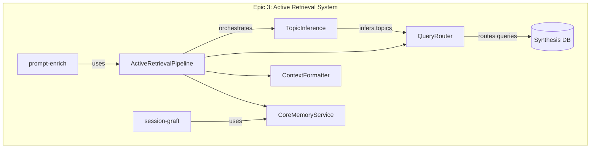
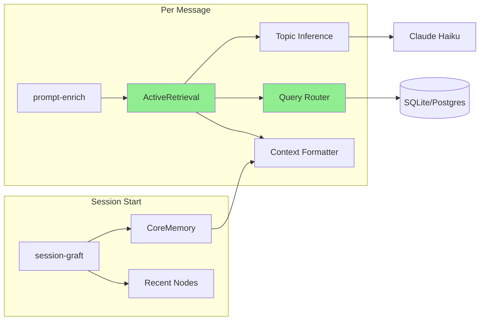
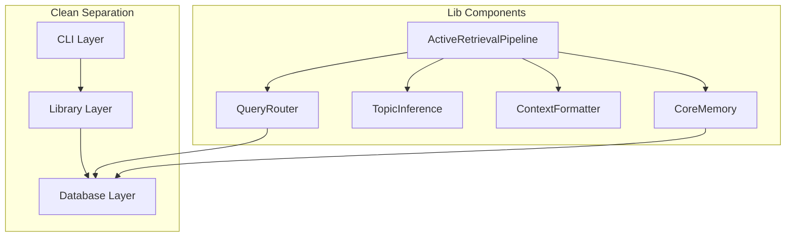

# Code Review: Epic 3 Batch 2 - Active Retrieval System

**Date**: 2025-12-14
**Reviewer**: Claude Code Review
**Scope**: Issue 3.2, 3.4, 3.5 - QueryRouter, Active Retrieval Pipeline Integration, Tests

## Files Reviewed

| File | Change Type | Lines |
|------|-------------|-------|
| `src/lib/query-router.ts` | NEW | 423 |
| `src/lib/active-retrieval.ts` | NEW | 296 |
| `src/cli/prompt-enrich.ts` | MODIFIED | 193 |
| `src/cli/session-graft.ts` | MODIFIED | 96 |
| `test/integration.ts` | MODIFIED | 979 |

---

## Pass 0: Change Explanation

### What Changed



**QueryRouter (`query-router.ts`)**: New component that routes search queries to appropriate memory types based on topic pattern analysis. It:
- Matches topics against regex patterns to determine node types (decision, learning, entity, event, task, summary)
- Supports parallel query execution across memory types
- Provides hybrid search integration when PostgreSQL backend is available
- Deduplicates and merges results with score normalization

**ActiveRetrievalPipeline (`active-retrieval.ts`)**: Orchestration layer that ties together:
- TopicInferenceService for extracting searchable topics from prompts
- QueryRouter for memory type dispatch
- CoreMemoryService for always-inject persona/human blocks
- ContextFormatter for structured XML output
- Parallel execution of topic inference and core memory fetch

**prompt-enrich.ts**: Refactored to support two modes:
- Active Retrieval mode (full pipeline with topic inference)
- Simple Search mode (legacy, faster vector-only search)
- Unified context formatting via ContextFormatter

**session-graft.ts**: Enhanced to:
- Use CoreMemoryService for persona/human blocks
- Use ContextFormatter for consistent output
- Query recent synthesis nodes for context injection

**integration.ts**: Added comprehensive tests for:
- ContextFormatter formatting
- CoreMemoryService operations
- QueryRouter planning and execution
- ActiveRetrievalPipeline end-to-end

### System Impact



---

## Pass 1: Technical Issue Identification

### Critical Issues

**None found.** The build compiles successfully and all tests pass.

### High Priority Issues

#### 1. Unused embedder parameter in simpleRetrieve

**File**: `/Users/alexander/Projects/totalrecall-plugin/src/lib/active-retrieval.ts`
**Line**: 243

```typescript
async simpleRetrieve(
  userPrompt: string,
  embedder: (text: string) => Promise<number[]>  // <-- UNUSED
): Promise<ActiveRetrievalResult> {
```

The `embedder` parameter is declared but never used. The method uses `this.queryRouter.routeAndExecute()` which already has access to the embedder passed during construction.

**Impact**: Dead parameter, confusing API surface
**Fix**: Remove the unused `embedder` parameter from the method signature

### Medium Priority Issues

#### 2. Potential race condition in metrics timing

**File**: `/Users/alexander/Projects/totalrecall-plugin/src/lib/active-retrieval.ts`
**Lines**: 140-152

```typescript
const inferenceStart = Date.now();
const coreMemoryStart = Date.now();  // Both set to same time

const [topicsResult, coreMemory] = await Promise.all([
  this.inferTopics(userPrompt),
  this.config.includeCoreMemory
    ? this.coreMemoryService.getBlocks()
    : Promise.resolve(null),
]);

metrics.inferenceMs = Date.now() - inferenceStart;
metrics.coreMemoryMs = Date.now() - coreMemoryStart;  // Same as inferenceMs!
```

Both `inferenceStart` and `coreMemoryStart` are set to the same value, so `inferenceMs` and `coreMemoryMs` will always be identical (whichever finishes last).

**Impact**: Misleading metrics - cannot distinguish individual operation times
**Fix**: Either accept that parallel operations share the same wall-clock time, or measure independently by wrapping each Promise

#### 3. Sort mutates input array

**File**: `/Users/alexander/Projects/totalrecall-plugin/src/lib/query-router.ts`
**Line**: 201

```typescript
const key = plan.nodeTypes?.sort().join(',') ?? 'all';
```

`Array.sort()` mutates the original array. If `plan.nodeTypes` is shared or reused elsewhere, this could cause unexpected behavior.

**Impact**: Potential mutation side effects
**Fix**: Use `[...plan.nodeTypes].sort()` to avoid mutation

#### 4. Magic number for minimum prompt length

**File**: `/Users/alexander/Projects/totalrecall-plugin/src/cli/prompt-enrich.ts`
**Line**: 153

```typescript
if (!prompt || prompt.length < 10) {
  // Skip very short prompts (likely commands or acknowledgments)
```

The threshold of 10 characters is hardcoded without documentation of why this specific value was chosen.

**Impact**: Not configurable, unclear rationale
**Fix**: Extract to a named constant with documentation, or make configurable via environment variable

---

## Pass 2: Code Consistency Analysis

### Pattern Consistency

#### Factory Function Naming

| Component | Factory Function | Consistent |
|-----------|-----------------|------------|
| QueryRouter | `createQueryRouter()` | Yes |
| ActiveRetrievalPipeline | `createActiveRetrievalPipeline()` | Yes |
| ContextFormatter | `createContextFormatter()` | Yes |
| CoreMemoryService | `createCoreMemoryService()` | Yes |

**Status**: Factory function pattern is consistently applied across all Epic 3 components.

#### Error Handling Pattern

The files use a consistent pattern of:
1. Try/catch with fallback behavior
2. Debug logging when enabled
3. Graceful degradation (return empty/default rather than throw)

```typescript
// Consistent pattern across files:
try {
  // operation
} catch (error) {
  if (this.config.debugLogging) {
    console.error('[Module] Operation failed:', error);
  }
  return fallbackValue;
}
```

**Status**: Consistent error handling approach.

### Inconsistency Found

#### Debug Logging Prefix

Most components use `console.error()` for debug logging, but the prefix varies:

| File | Prefix |
|------|--------|
| query-router.ts | `[QueryRouter]` |
| active-retrieval.ts | `[ActiveRetrieval]` |
| prompt-enrich.ts | `[totalrecall]` |
| topic-inference.ts | `[TopicInference]` |

**Impact**: Minor - inconsistent log prefix makes filtering harder
**Suggestion**: Standardize on `[TotalRecall:ComponentName]` format

---

## Pass 3: Architecture & Refactoring

### Code Duplication

#### Token Estimation Duplicated

The token estimation logic appears in multiple places:

1. **ContextFormatter** (`context-formatter.ts:225-228`)
```typescript
estimateTokens(text: string): number {
  return Math.ceil(text.length / CHARS_PER_TOKEN_ESTIMATE);
}
```

2. **CoreMemoryService** (`core-memory.ts:148-150`)
```typescript
private estimateTokens(text: string): number {
  return Math.ceil(text.length / CHARS_PER_TOKEN_ESTIMATE);
}
```

Both use `CHARS_PER_TOKEN_ESTIMATE = 4`.

**Suggestion**: Extract to a shared utility, e.g., `src/lib/utils/token-utils.ts`

### Architecture Assessment



**Assessment**: Good architectural separation. The ActiveRetrievalPipeline correctly orchestrates the subcomponents without tight coupling. Each component can be tested independently.

### Potential Improvement

The `simpleRetrieve` method in `ActiveRetrievalPipeline` duplicates much of the `retrieve` method logic. Consider:

```typescript
// Current: separate simpleRetrieve method
async simpleRetrieve(...) { /* duplicate formatting logic */ }

// Better: make retrieve() configurable
async retrieve(userPrompt: string, options?: { skipTopicInference?: boolean })
```

---

## Pass 4: Environment Compatibility

### Platform Dependencies

| Dependency | Required | Fallback |
|------------|----------|----------|
| ANTHROPIC_API_KEY | For topic inference | Falls back to direct prompt search |
| PostgreSQL | For hybrid search | Falls back to vector-only (SQLite) |
| Embedding model | Required | Downloads on first run (~23MB) |

### Environment Variable Handling

**File**: `/Users/alexander/Projects/totalrecall-plugin/src/cli/prompt-enrich.ts`

```typescript
const ACTIVE_RETRIEVAL_ENABLED = process.env.ACTIVE_RETRIEVAL_ENABLED === 'true';
const ANTHROPIC_API_KEY = process.env.ANTHROPIC_API_KEY;
const DEBUG_LOGGING = process.env.TOTALRECALL_DEBUG === 'true';
```

**Status**: Environment variables are read at module load time. This is appropriate for CLI tools.

### Compatibility Notes

1. **Node.js Version**: Code uses modern async/await and optional chaining. Requires Node.js 14+.
2. **SQLite**: Uses sqlite-vec extension for vector operations. Must be available.
3. **Database Backend**: Hybrid search (BM25/trigram) only works with PostgreSQL backend.

---

## Pass 5: Verification Strategy

### Verification Commands

```bash
# 1. Verify TypeScript compilation
npm run build

# 2. Run integration tests
npm test

# 3. Test prompt enrichment modes
TOTALRECALL_DEBUG=true ACTIVE_RETRIEVAL_ENABLED=false echo '{"prompt":"test prompt for search"}' | node dist/cli/prompt-enrich.js

TOTALRECALL_DEBUG=true ACTIVE_RETRIEVAL_ENABLED=true ANTHROPIC_API_KEY=sk-... echo '{"prompt":"what decisions were made about authentication"}' | node dist/cli/prompt-enrich.js

# 4. Test session graft
echo '{"session_id":"test-123"}' | node dist/cli/session-graft.js

# 5. Verify QueryRouter pattern matching
node -e "
const { createQueryRouter } = require('./dist/lib/query-router.js');
const explanations = createQueryRouter({}).explainRouting([
  'decision about TypeScript',
  'what happened yesterday',
  'who is John'
]);
console.log(JSON.stringify(explanations, null, 2));
"
```

### Checks Performed

- [x] `npm run build` - Compiles without errors
- [x] `npm test` - All 14 test suites pass (including new Epic 3 tests)
- [x] Grep for type consistency - All types align with schema.ts
- [x] Verify factory function exports - All accessible via module imports

---

## Pass 6: Task Summary

### Summary of Changes

This batch implements the core Active Retrieval pipeline for Epic 3:

1. **QueryRouter** routes queries to appropriate memory types based on topic pattern analysis
2. **ActiveRetrievalPipeline** orchestrates topic inference, query routing, and context formatting
3. **prompt-enrich** now supports both Active Retrieval (with topic inference) and Simple Search modes
4. **session-graft** uses CoreMemoryService and ContextFormatter for consistent output
5. **Tests** cover all new components with 4 new test functions

### Key Design Decisions

1. **Parallel Execution**: Topic inference and core memory fetch run in parallel to minimize latency
2. **Graceful Degradation**: If topic inference fails, falls back to using the original prompt
3. **Pattern-Based Routing**: Regex patterns map topics to node types for efficient retrieval
4. **Hybrid Search**: Supports PostgreSQL hybrid search when available, falls back to vector-only
5. **Consistent Formatting**: All context injection uses ContextFormatter for XML structure

### Test Coverage

| Component | Tests | Status |
|-----------|-------|--------|
| ContextFormatter | Age formatting, token estimation, memory formatting, core memory | PASS |
| CoreMemoryService | set/get/append/delete blocks, formatForInjection | PASS |
| QueryRouter | planQueries, explainRouting, routeAndExecute | PASS |
| ActiveRetrievalPipeline | Full pipeline with metrics verification | PASS |

---

## Suggest Fixing

### High Priority

1. **[active-retrieval.ts:243]** Remove unused `embedder` parameter from `simpleRetrieve()` method signature.

### Medium Priority

2. **[query-router.ts:201]** Use `[...plan.nodeTypes].sort()` instead of `plan.nodeTypes?.sort()` to avoid array mutation.

3. **[prompt-enrich.ts:153]** Extract magic number `10` to named constant: `const MIN_PROMPT_LENGTH = 10; // Skip acknowledgments like "ok", "thanks"`

4. **[active-retrieval.ts:140-152]** Add comment explaining that parallel operations share wall-clock timing, or restructure metrics collection.

---

## Possible Simplifications

1. **Merge simpleRetrieve into retrieve()**: Add optional flag `{ skipTopicInference?: boolean }` to avoid code duplication.

2. **Extract token estimation to shared utility**: Create `src/lib/utils/tokens.ts` with `estimateTokens()` function to eliminate duplication.

3. **Standardize log prefixes**: Use consistent format `[TotalRecall:ComponentName]` across all modules.

---

## Consider Asking User

1. Should `simpleRetrieve()` be deprecated in favor of configurable `retrieve()` method?

2. Is the 10-character minimum prompt length appropriate, or should it be configurable?

3. Should metrics collection differentiate between parallel operation times (requires wrapper promises)?

---

## Suggested Checks

The following commands verify the implementation:

```bash
# Already performed and passing:
npm run build  # TypeScript compilation
npm test       # All integration tests

# Additional manual verification:
# Test query routing patterns
grep -E "pattern:" src/lib/query-router.ts

# Verify type exports
grep "export.*interface" src/lib/query-router.ts src/lib/active-retrieval.ts
```

---

## Verdict

**APPROVE WITH SUGGESTIONS**

The implementation is solid with good architectural separation, comprehensive tests, and graceful degradation. The issues identified are minor and do not block functionality:

- 1 High Priority issue (unused parameter)
- 3 Medium Priority issues (mutation, magic number, misleading metrics)

All tests pass, build succeeds, and the Active Retrieval pipeline is functional.

---

*Code Review by Claude Code - 6-Pass Comprehensive Review*
